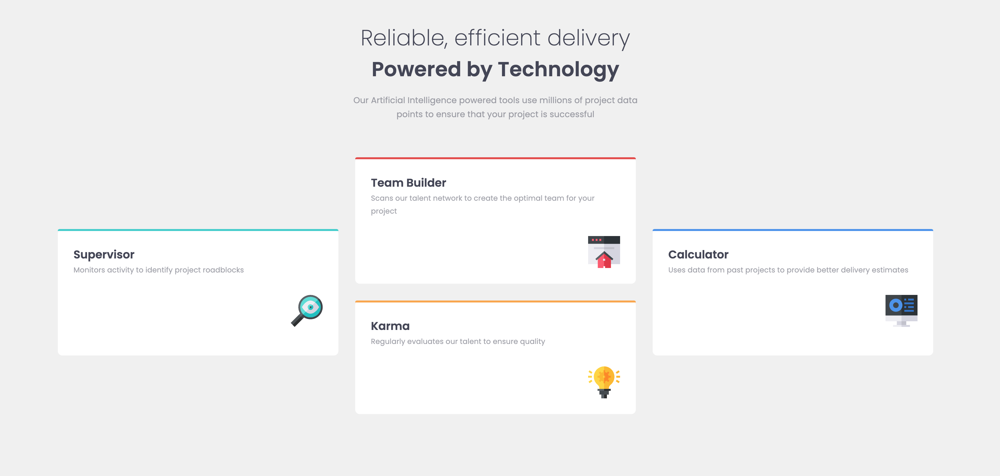

# Frontend Mentor - Four card feature section solution

This is a solution to the [Four card feature section challenge on Frontend Mentor](https://www.frontendmentor.io/challenges/four-card-feature-section-weK1eFYK). Frontend Mentor challenges help you improve your coding skills by building realistic projects.

## Table of contents

- [Overview](#overview)
  - [The challenge](#the-challenge)
  - [Screenshot](#screenshot)
  - [Links](#links)
- [My process](#my-process)
  - [Built with](#built-with)
  - [What I learned](#what-i-learned)
- [Author](#author)

**Note: Delete this note and update the table of contents based on what sections you keep.**

## Overview

### The challenge

Users should be able to:

- View the optimal layout for the site depending on their device's screen size

### Screenshot

### Links

- [See live site here](https://thomaserdmenger.github.io/four-card-feature-section-react/)
- [GitHub Repository](https://github.com/thomaserdmenger/four-card-feature-section-react)

## My process

### Built with

- Semantic HTML5 markup
- CSS custom properties
- Flexbox
- CSS Grid
- Mobile-first workflow
- [React](https://reactjs.org/) - JS library

### What I learned

I learned how to create a React app, use props to pass information from one component to another and how to deploy it on GitHub-Pages.

## Author

- Frontend Mentor - [@thomaserdmenger](https://www.frontendmentor.io/profile/thomaserdmenger)
- GitHub - [@thomaserdmenger](https://github.com/thomaserdmenger)
